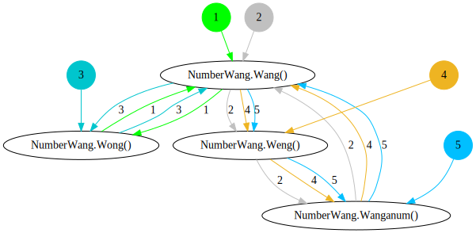

# csharp-method-dependency-analysis
1) determine recursive method chains in a class 
2) TODO: group methods of a class by their dependencies... 

* uses roslyn to parse, query and analize instances of `InvocationExpressionSyntax`...
* uses msbuild to load solutions and projects

## determine recursive method chains in a class 
* given a class
``` c#
using System;
public partial class NumberWang { 
    public void Wang() {
        Wong();
        Weng();
    }
}
public partial class NumberWang { 
    public void Wong() {
        Wang();
    }
}
public partial class NumberWang { 
    public void Weng() {
        Wanganum();
    }
    public void Wanganum() {
        Wang();
    }
}
```
* output 

